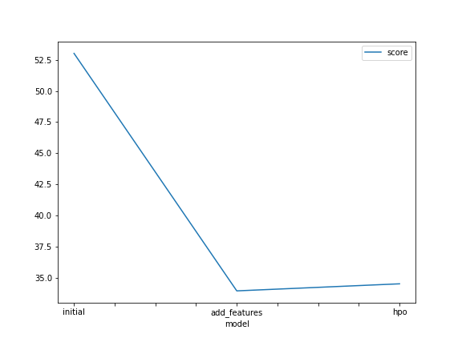
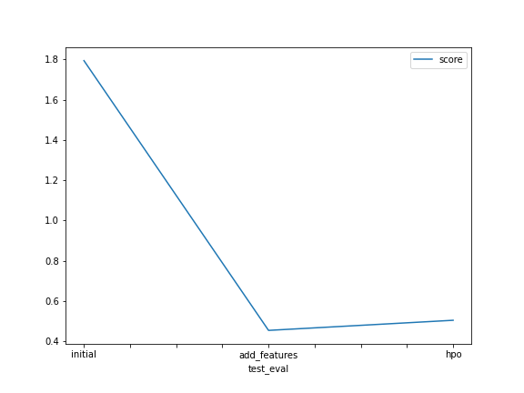

# Report: Predict Bike Sharing Demand with AutoGluon Solution
#### Mohak Gupta

## Initial Training
### What did you realize when you tried to submit your predictions? What changes were needed to the output of the predictor to submit your results?

The following three experiments were carried out:

1. Initial Raw Submission [Model: initial]
2. Added Features Submission (EDA + Feature Engineering) [Model: add_features]
3. Hyperparameter Optimization (HPO) [Model: hpo]

Observation: When the predictions from all five of these experiments were submitted, some of the experiments produced predictions with negative values.

Changes made: Kaggle rejects submissions that contain predictions that were made with negative values according to the predictor. Therefore, all of these negative outputs from the appropriate predictors were changed to 0.

### What was the top ranked model that performed?
The model with the highest ranking, the `(add features)` model dubbed `WeightedEnsemble_L3`, had the best Kaggle score of `0.45368` and the highest RMSE score of `33.946503` (on test dataset).

## Exploratory data analysis and feature creation
### What did the exploratory analysis find and how did you add additional features?

- Using feature extraction, the data for the features `year`,`month`, `day` (dayofweek), and `hour` were separated out as different, independent features from the `datetime` feature. The `datetime` feature was removed when features were extracted.

- Independent characteristics `season` and `weather` were initially interpreted as integers. These variables were converted into category data types since they are categorical in nature.

- It was observed that the RMSE scores were improved during cross-validation when the features `casual` and `registered` were taken into account, and that both independent features were highly correlated with the target variable count. These features were discarded during training because they are only present in the train dataset and are not present in the test dataset.

### How much better did your model preform after adding additional features and why do you think that is?

- After changing some categorical variables with integer data types to their correct categorical datatypes, the model's performance improved.

- Additionally, dividing the `datetime` feature into several independent features, such as `year,` `month,` `day,` and `hour,` as well as the addition of `day_type,` further improved the model performance because these predictor variables help the model more accurately determine whether the data show seasonality or historical patterns.

## Hyper parameter tuning
### How much better did your model preform after trying different hyper parameters?
The performance of the model was improved over the model's original submission thanks to hyperparameter adjustment. The model with EDA and extra features performed significantly better on the Kaggle (test) dataset, despite hyperparameter optimised models delivering competitive performances in comparison.

### If you were given more time with this dataset, where do you think you would spend more time?
If I had more time to work with this dataset, I'd like to explore other outcomes that might occur when AutoGluon is run for a prolonged length of time with a high-quality preset and improved hyperparameter tuning.

### Create a table with the models you ran, the hyperparameters modified, and the kaggle score.
|model|hpo1|hpo2|hpo3|score|
|--|--|--|--|--|
|initial|prescribed_values|prescribed_values|"presets: 'high quality' (auto_stack=True)"|1.79454|
|add_features|prescribed_values|prescribed_values|"presets: 'high quality' (auto_stack=True)"|0.45368|
|hpo|Tree-Based Models: (GBM, XT, XGB & RF)|KNN|"presets: 'optimize_for_deployment"	|0.50395|

### Create a line plot showing the top model score for the three (or more) training runs during the project.

TODO: Replace the image below with your own.

### Create a line plot showing the top kaggle score for the three (or more) prediction submissions during the project.

TODO: Replace the image below with your own.

## Summary

- In this bike sharing demand prediction project, the AutoGluon AutoML framework for Tabular Data was carefully examined and used.

- By utilising data from rigorous exploratory data analysis (EDA) and feature engineering without hyperparameter optimisation, the top-ranked AutoGluon-based model greatly improved results.

- AutGluon was able to investigate and take advantage of the best potential alternatives by utilising automatic hyperparameter tweaking, model selection/ensembling, and architecture search.

- Additionally, AutoGluon's hyperparameter tuning offered performance gains over the first raw submission, but they fell short of the model's performance with EDA, feature engineering, and no hyperparameter tuning.